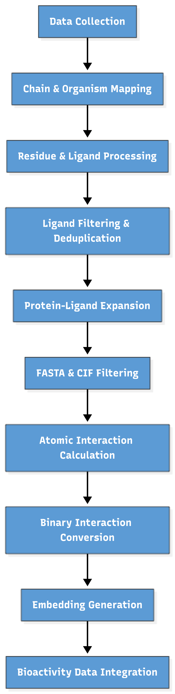

# **Protein-Ligand Interaction Dataset Pipeline**

## **Summary**

Comprehensive pipeline for curating and integrating protein-ligand structural and bioactivity data from PDB, PDBe, UniProt, BindingDB, PDBBind, and ChEMBL. Processes CIF/FASTA files, filters ligands, computes atomic interactions, generates embeddings (ESM-2 for proteins, Mordred for ligands), and produces a unified dataset suitable for machine learning modeling of protein-ligand interactions.

## **Context and Motivation**

The rapid growth of structural and bioactivity data has positioned machine learning (ML) as a transformative tool in drug discovery, enabling tasks such as hit identification, lead optimization, and binding affinity prediction. However, the predictive performance of ML models critically depends on the availability of high-quality, well-curated datasets that integrate chemical, structural, and bioactivity information.

Existing protein–ligand datasets are fragmented across multiple databases (e.g., PDBbind, BindingDB, ChEMBL, BioLiP), often exhibiting heterogeneous formats, inconsistent labeling, missing values, and limited structural coverage. Moreover, few resources provide unified representations that combine three-dimensional structures, residue-level interactions, and standardized bioactivity measurements, limiting their suitability for AI-ready applications.

This project addresses these limitations by providing a comprehensive, standardized, and ML-ready protein–ligand dataset. It integrates high-resolution structural data, curated bioactivity measurements, consistent chemical annotations, and atom-level interaction labels, enabling models to learn detailed spatial and physicochemical interaction patterns. The resulting dataset reduces heterogeneity and annotation bias, supporting robust, interpretable, and generalizable ML workflows for protein–ligand interaction modeling and binding affinity prediction.

## **Pipeline Overview**

The pipeline consists of eight major stages:

1. **Data acquisition**
- Download of protein structures (CIF) from PDB using curated PDB ID lists
- Extraction of metadata: experimental method, resolution, organism

2. **Protein and ligand extraction**
- Parsing of ATOM (protein) and HETATM (ligand) records
- Chain splitting and residue normalization
- FASTA sequence extraction for protein chains

3. **Filtering and dataset curation**
- Removal of non-biological or ambiguous chains and ligands
- Deduplication by SMILES, InChI, InChIKey
- Merging of exclusion lists (BioLiP2, manual curation, Q-BioLip)

4. **Protein–ligand expansion and merging**
- Expansion of ligands per chain
- Removal of covalent links
- Integration of protein and ligand metadata into a unified dataset

5. **CIF and FASTA filtering**
- Retain only chains and ligands present in the curated dataset
- Generation of filtered CIF structures and FASTA sequences

6. **Atomic interaction computation**
- Extraction of atom coordinates (ignoring hydrogens)
- Calculation of protein–ligand atom distances (<4.5 Å → interacting)
- Conversion into binary interaction matrices

7. **Feature generation**
- Protein embeddings using ESM-2 (1280-dim per residue)
- Ligand descriptors using Mordred (1600 features)

8. **Bioactivity integration**
- Merging of experimental affinities from BindingDB, PDBBind, ChEMBL
- Standardization of units and computation of pChEMBL values



## **Folder structure**

```text
protein-ligand-interaction-dataset-pipeline
│
├── README.md                     # Project overview
├── LICENSE                       # License file
├── .gitignore                    # Files/folders to ignore in git
├── .gitatributes                 # Configuration files
├── requirements.txt              # Python dependencies
├── environment.yml               # Conda environment (optional)
├── Dockerfile                    # Docker configuration for reproducibility
│
├── configs/                      # Configuration files
│
├── data/                         # Project data
│   ├── raw/                      # Original, unmodified data
│   │   ├── pdb_ids/              # PDB ID list files
│   │   ├── cif_structures/       # Original CIF files
│   │   ├── ligand_databases/     # Components CIF files, ligand info
│   │   ├── excluded_ligands_datasets/ # Lists of ligands to exclude
│   │   └── binding_affinity_external_dataset/ # External datasets like PDBBind
│   │
│   ├── interim/                  # Intermediate outputs from pipeline steps
│   │   ├── split_cif_chains/
│   │   ├── fasta_sequences/
│   │   ├── filtered_datasets/    # Filtered CSV/XLSX outputs
│   │   └── interaction_details_csv_cif/
|   |
│   ├── interactions/                      # Interaction datasets             
│   │   ├── interaction_details_csv_cif/
│   │   └── binary_interactions_csv/
│   │
│   └── binding_affinity/     # External datasets of binding affinities for integration
│
├── src/                          # Source code
│   ├── pipeline/                 # Stepwise scripts organized by pipeline steps
│   │   ├── 01_pdb_download/
│   │   ├── 02_cif_protein_chain_and_ligand_extraction/
│   │   ├── 03_filtering/
│   │   ├── 04_covalent_bonds/
│   │   ├── 05_expand_filter_merge_ligand_dataset/
│   │   ├── 06_filter_cif_fasta_by_ligands/
│   │   └── 07_uniprot_mappings/
|   |
│   ├── interactions/                    # Code for interactions
|   |
│   ├── features/                    # Code for embeddings/descriptors
│   │   └── esm_embeddings.py                
│   │
│   └── binding_affinity        #Code for binding affinity databases
│       ├── BindingPDB.py/
│       ├── ChEMBL.py/
│       └── PDBBind.py/
│
├── pipelines/                    # Scripts to run full or partial pipelines
│   ├── run_pipeline.py
│   ├── run_interactions.py
│   ├── run_features.py
│   ├── run_binding_affinity.py
│   └── run_all.py                  
│
├── notebooks/                     # Jupyter notebooks for EDA or visualization
│   ├── 01_data_analysis.ipynb
│   └── 02_interactions_analysis.ipynb
│
├── results/                       # Generated results like tables and figures
│   ├── tables/
│   └── figures/
│
└── docs/                          # Additional documentation
    └── pipeline_overview.md
```

### **Detailed Workflow**

- **Step 01 – PDB Download**
Input: rcsb_pdb_ids_03_09.txt
Download CIF files from RCSB PDB API
Extract metadata: experimental method, resolution, organism
Filter only proteins with experimental structures
Output files: cif/, protein_data.csv, chain_organisms.csv
- **Step 02 – CIF Protein Chains and Ligand Extraction**
Parse ATOM (protein) and HETATM (ligand) records
Convert modified residues to standard amino acids
Discard ambiguous chains (SEC, PYL, UNK)
Extract sequences, positions, chain IDs
Output files: ligands_per_chain.csv, split_cif_chains/, fasta_sequences/
- **Step 03 – Ligand & Chain Filtering**
Remove non-biological, short, or invalid chains
Remove PDB duplicates
Apply chemical and functional rules for ligands
Merge exclusion lists (BioLiP2, manual, Q-BioLip)
Deduplicate by SMILES, InChI, InChIKey
Output files: ligands_per_chain_filtered.csv, chain_organisms_filtered.csv, protein_data_filtered.csv, ligands_filtered.csv, ligands_excluded.csv, ligands_excluded_conflicts.csv
- **Step 04 – Protein-Ligand Expansion**
Expand ligands per chain
Remove covalent links using covalent_links.csv
Merge protein and ligand metadata
Output file: filtered_df.xlsx
- **Step 05 – Filter CIFs & FASTA Sequences by Ligands**
Retain only chains and ligands present in filtered_df.xlsx
Output files: split_cif_chains_filtered/, fasta_sequences_filtered/
- **Step 06 – Atomic Interaction Calculation and Binary Interaction Conversion**
Extract atom coordinates, ignore hydrogens
Separate protein and ligand atoms
Compute atom-atom distances (<4.5 Å → interacting)
Encode interactions as 1 (interacting) or 0 (non-interacting)
Output files: interaction_details_csv_cif/
Output files: binary_interactions_csv/
- **Step 07 – Protein & Ligand Embeddings**
Proteins: ESM-2 embeddings (1280-dim per residue)
Ligands: Mordred descriptors (1600 features)
Verify FASTA sequences match CSV
Output file: interaction_dataset.hdf5
- **Step 08 – Bioactivity Integration**
Merge experimental affinities from BindingDB, PDBBind, ChEMBL
Standardize units, compute pChEMBL
Output files: filtered_df_with_BindingDB.csv, filtered_df_with_PDBBind.csv, ChEMBL_activities.csv

## **Quick Start**

Clone the repository:

git clone https://github.com/Leonorafonso28/protein-ligand-interaction-dataset-pipeline

Install dependencies:

pip install -r requirements.txt

Run the full pipeline:

python pipelines/run_all.py

## **Future Work**

While the current pipeline generates high-quality protein and ligand features, atom-level interactions, and curated bioactivity data, several key steps remain to fully enable ML applications:

1. **Dataset integration and merging**
- Combine structural, ligand, interaction, and bioactivity information into a single, unified ML-ready dataset.

2. **Preprocessing and dataset splitting**
- Standardize features, handle missing values, and implement train/validation/test splits for robust model evaluation.

3. **Machine learning model development**
- Train and benchmark models for protein–ligand interaction prediction, including binary interaction classification and binding affinity estimation.
- Explore deep learning architectures leveraging ESM-2 embeddings and Mordred descriptors, as well as classical ML approaches for comparison.


